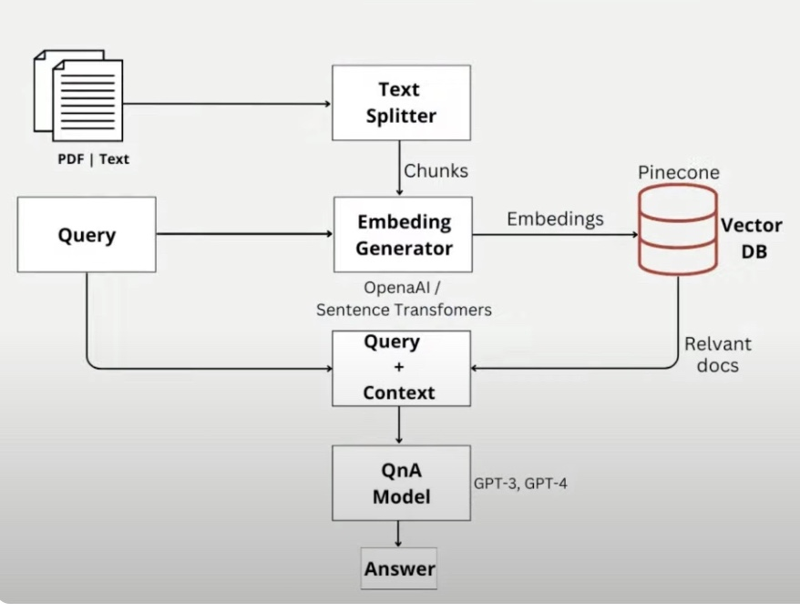

# **AI Event Manager Chatbot** 🎉🤖


<p align="center">
  
</p> 

**AI Event Manager** is an interactive chatbot that helps users plan and discover personalized event experiences. It leverages OpenAI, LangChain, Pinecone, and Sentence Transformers to provide intelligent recommendations and maintain conversational context.  

---

## **Features**  

- **Conversational AI:** Chat naturally with an event-focused assistant.  
- **Context Awareness:** Remembers past interactions for follow-up queries.  
- **Query Refinement:** Optimizes user input for precise responses.  
- **Knowledge Base Matching:** Uses embeddings and Pinecone to find relevant event info.  
- **Real-Time Interaction:** Built with **Streamlit** for a smooth, interactive experience.  

---

## **How It Works**  

- Users type their query in the chat interface.  
- The system **refines the query** using OpenAI to match it with the knowledge base.  
- Searches **Pinecone embeddings** for the most relevant context.  
- Generates a response via **LangChain + ChatOpenAI** using conversation memory.  
- Displays a **chat-style interaction** with past messages retained.  

---

## **Tech Stack**  

- **Python**  
- **Streamlit** for UI  
- **LangChain** for LLM orchestration  
- **OpenAI GPT-4** for natural language understanding  
- **Pinecone** for vector search and knowledge retrieval  
- **Sentence Transformers** for embeddings  

---

## **Getting Started**  

1. Clone the repo:  
   ```bash
   git clone <repo-url>
2. Install dependencies:
   ```bash
   pip install -r requirements.txt


3. Add your API keys in a .env file:

```bash
  OPENAI_API_KEY=<your_openai_key>
  SERPAPI_API_KEY=<your_serpapi_key>
  PINECONE_API_KEY=<your_pinecone_key>

  Run the app:
  streamlit run app.py
